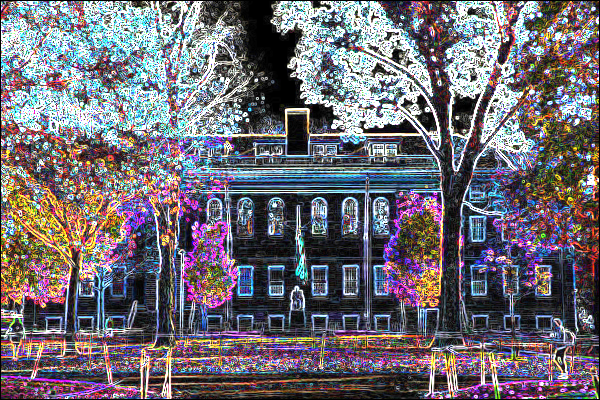

# Picture_filters
From CS50x 

## EXAMPLE

**before:**

 
 
**after:**


**or:**



### TERMINAL
```
clang -fsanitize=signed-integer-overflow -fsanitize=undefined -ggdb3 -O0 -Qunused-arguments -std=c11 -Wall -Werror -Wextra -Wno-sign-compare -Wno-unused-parameter -Wno-unused-variable -Wshadow -o filter filter.c helpers.c
```
```
./filter -(one letter: b/e/g/r) path_and_name_of_input_image.bmp name_of_output_image.bmp
```
***Exaples***
Blur
```
./filter -b images/yard.bmp out.bmp 
```
Edges 
```
./filter -e images/yard.bmp out.bmp 
```
Grayscale
```
./filter -g images/yard.bmp out.bmp
```
Reflect
```
./filter -r images/yard.bmp out.bmp 
```

>Make fun in helpers.c, the best is edges :)
>[CS50 IDE](https://ide.cs50.io/)
